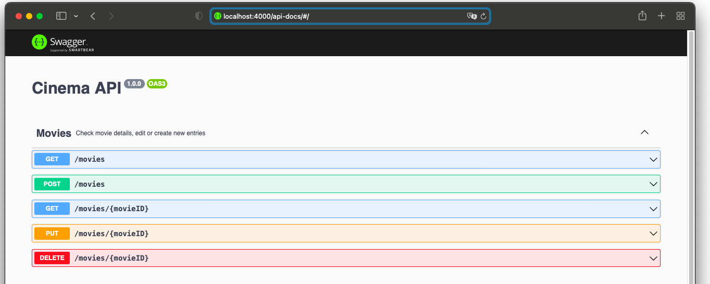

# swagger-api

## 🚀 Projeto
Um exemplo de documentação de rotas de API com Swagger. Especificação de endpoints, parâmetros, retorno, tudo facilmente documentável e consultável em uma página web disponível em uma rota da própria API.

<div align="center">
    
</div>

## 🛠️ Tecnologias
- [Swagger](https://swagger.io)
- [swagger-jsdoc](https://www.npmjs.com/package/swagger-jsdoc)
- [swagger-ui-express](https://www.npmjs.com/package/swagger-ui-express)

## 🗂️ Utilização

### 🐑🐑 Clonando o repositório:

```bash
  $ git clone url-do-projeto.git
```

### ▶️ Rodando o App:

```bash
  $ cd swagger-api
  $ npm install             #download dependencies to node_modules
  $ npm run dev             #start the project
```

Consultar a documentação em: [localhost:4000/api-docs](http://localhost:4000/api-docs)
