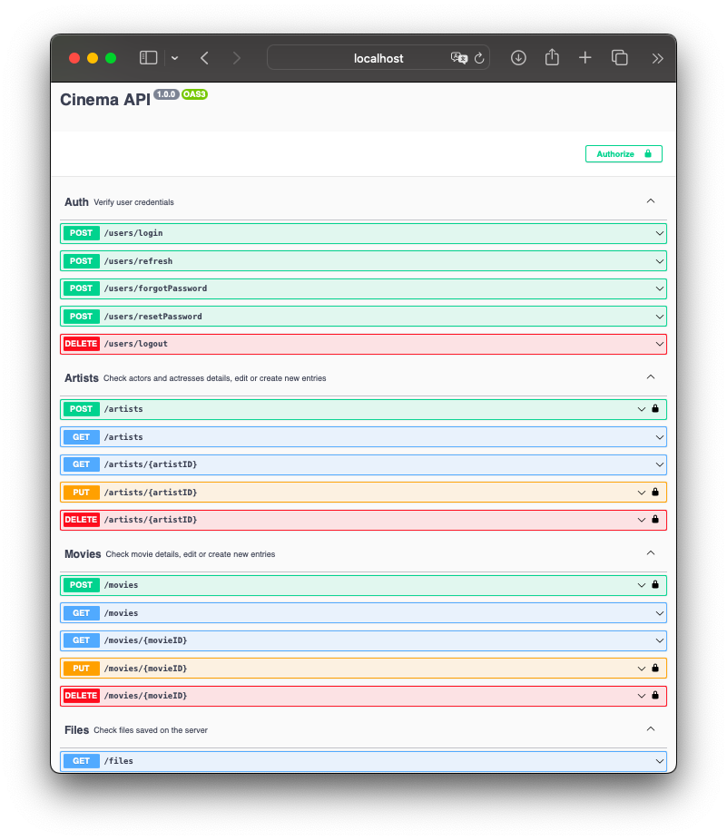
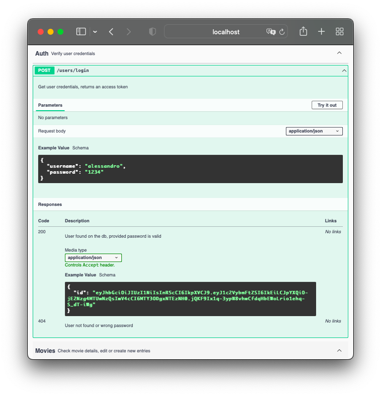
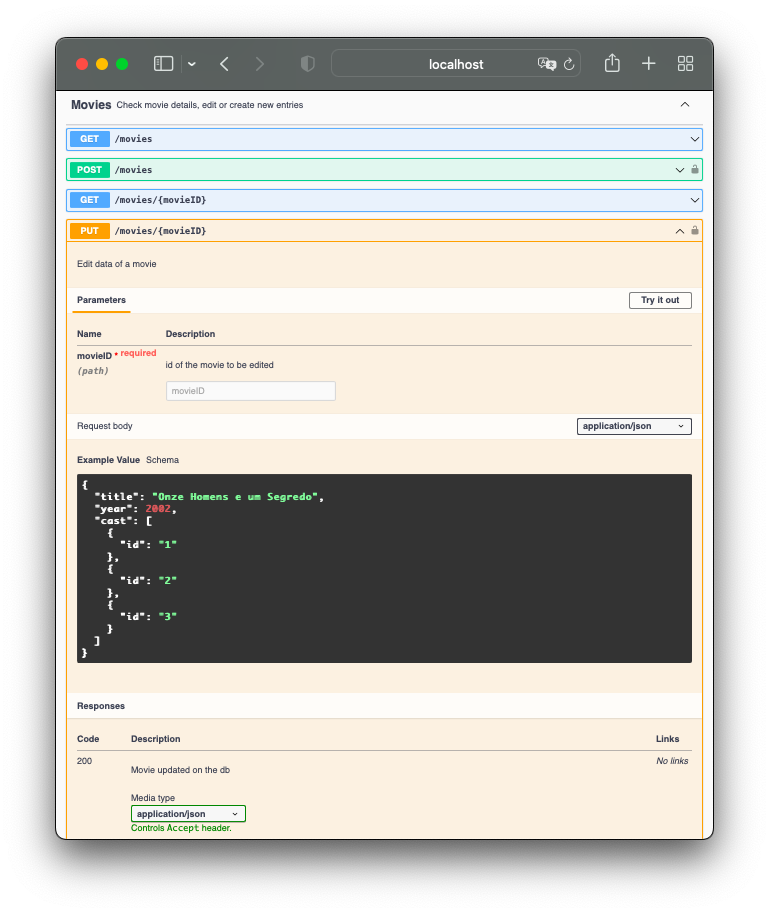
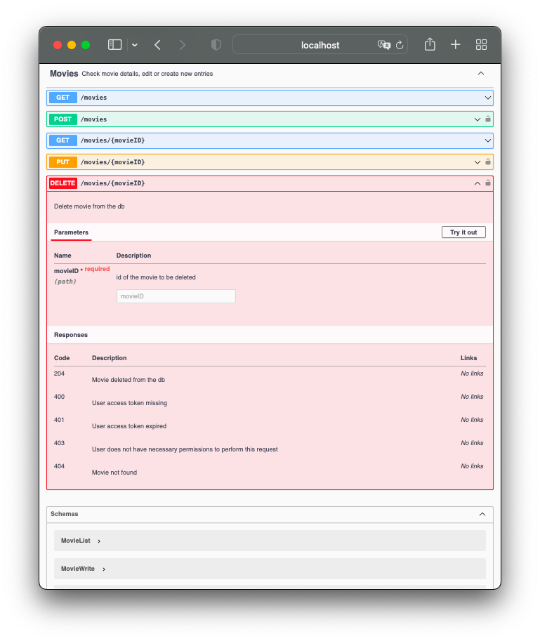

# swagger-api
<!--
<div align="center">

</div>
-->


## 🚀 Projeto
Um exemplo de documentação de rotas de API com Swagger. Especificação de endpoints, parâmetros, retorno, tudo facilmente documentável e consultável em uma página web disponível em uma rota da própria API.</br>
</br>
Confira online! [https://swagger-api-kappa.vercel.app/api-docs/](https://swagger-api-kappa.vercel.app/api-docs/)

<div align="center">
  <a href="https://swagger-api-kappa.vercel.app/api-docs/">
    
  </a>
</div>
<div align="center">
  <a href="https://swagger-api-kappa.vercel.app/api-docs/">
    
  </a>
  <a href="https://swagger-api-kappa.vercel.app/api-docs/">
    
  </a>
  <a href="https://swagger-api-kappa.vercel.app/api-docs/">
    
  </a>
</div>

## 🛠️ Tecnologias
- [Swagger](https://swagger.io)
- [swagger-jsdoc](https://www.npmjs.com/package/swagger-jsdoc)
- [swagger-ui-express](https://www.npmjs.com/package/swagger-ui-express)

## 🧊 Cool features
- Autenticação de usuários (login) com [JWT](https://jwt.io) para uso das rotas autenticadas.
- Controle de sessão de usuário com <code>accessToken</code>(validade curta (ex.: 5 min)) e <code>refreshToken</code>(revalida sessão automaticamente sem precisar repetir login).
- Limite de acessos por período (Ex.: 60 requests por minuto).
- Requisições de envio de dados (JSON) e arquivos (Multipart form).

## 🗂️ Utilização

### 🐑🐑 Clonando o repositório:

```bash
  $ git clone url-do-projeto.git
```

### ▶️ Rodando o App:

```bash
  $ cd swagger-api        #change to that directory
  $ cp .env.example .env  #create the ".env" file like the ".env.example" file
  $ npm install           #download dependencies to node_modules
  $ npm run dev           #start the project
```

Consultar a documentação em: [localhost:4000/api-docs](http://localhost:4000/api-docs)

## ⭐ Like, Subscribe, Follow!
Curtiu o projeto? Marque esse repositório com uma Estrela ⭐!
